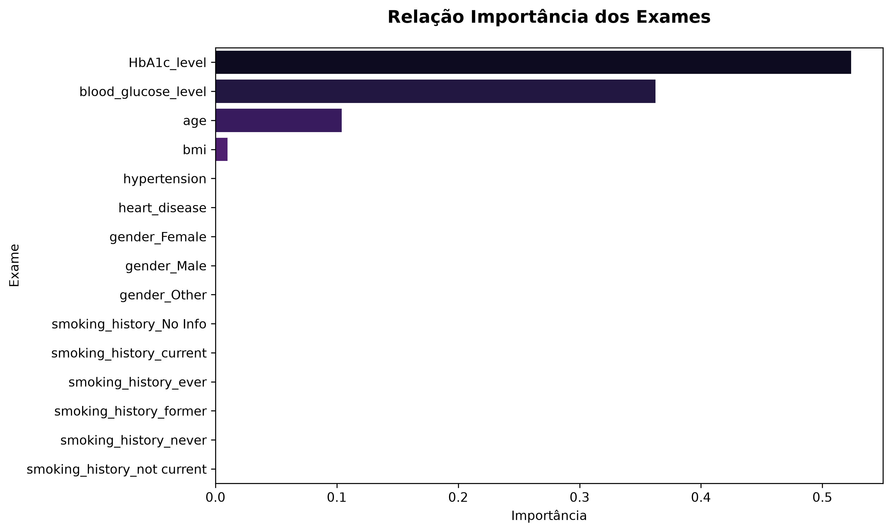
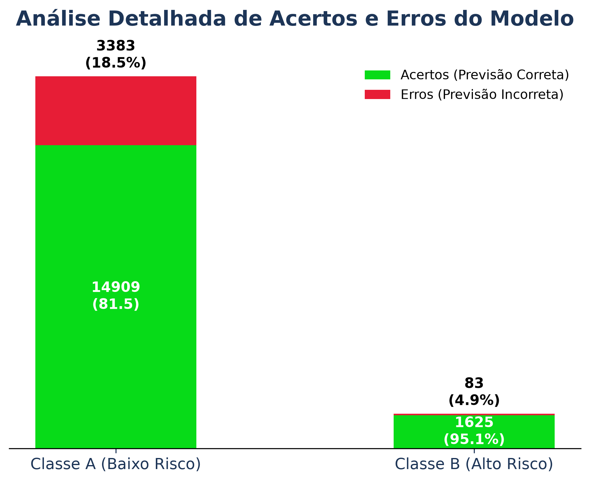
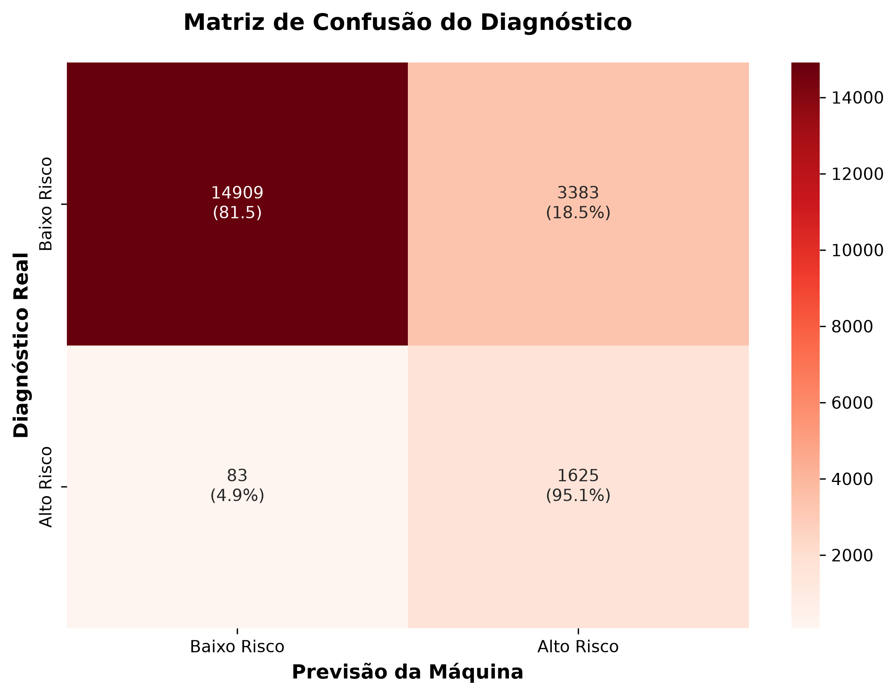
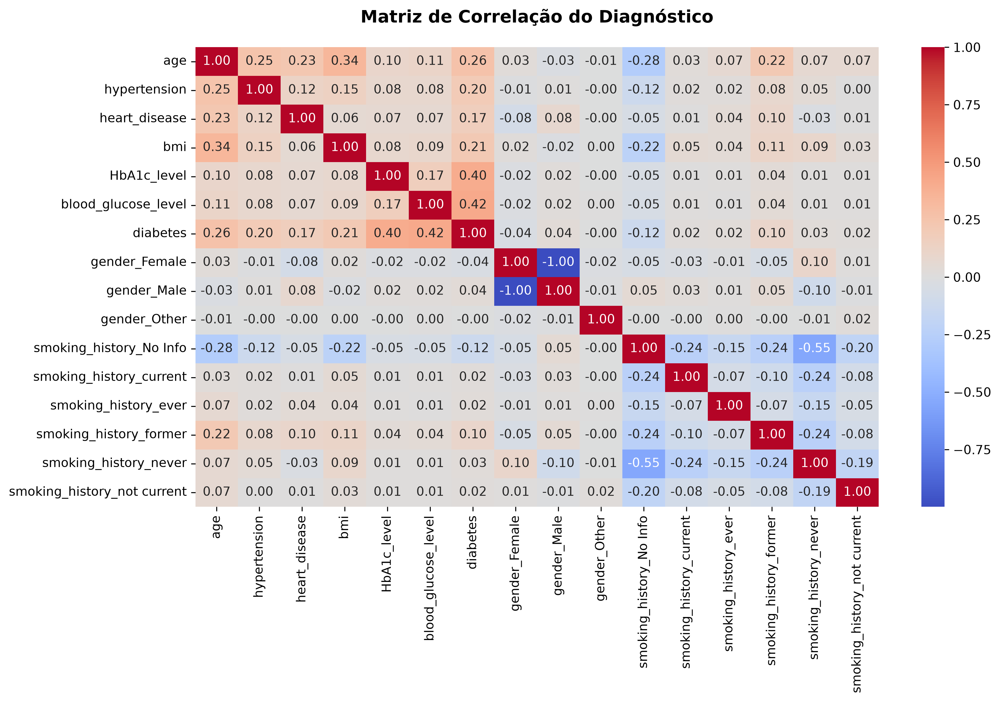

# 🩺 Sistema de Diagnóstico Preditivo para Diabetes (Machine Learning)


## 📌 Descrição do Projeto
Em um ambiente hospitalar, o diagnóstico precoce e preciso de diabetes salva vidas e otimiza recursos. Este projeto é um sistema de **Machine Learning (Árvore de Decisão)** desenvolvido para atuar como um "segundo olhar" médico, triando pacientes com base em seus exames de sangue e histórico de saúde. 

O modelo foi projetado com um foco rigoroso na área da saúde, possuindo um *recall* de **95% para pacientes de alto risco**, garantindo que quase nenhum doente passe despercebido. Além disso, o sistema conta com uma esteira automatizada de auditoria de dados, que trata valores faltantes no prontuário utilizando imputação estatística (Média para exames, Moda para dados cadastrais), evitando a perda de histórico de pacientes.

---

## 🛠️ Índice
- [Demonstração Visual](#demonstração-visual)
- [Pré-requisitos](#pré-requisitos)
- [Instalação e Uso](#instalação-e-uso)
- [Destaques da Arquitetura de Dados](#destaques-da-arquitetura-de-dados)
- [Tecnologias Utilizadas](#tecnologias-utilizadas)
- [Como Contribuir](#como-contribuir)
- [Licença](#licença)
- [Contato](#contato)

---

## 📊 Demonstração Visual

O sistema gera automaticamente relatórios visuais essenciais para a explicabilidade da IA (*Explainable AI*) perante a equipe médica. 

* **Relação de Importância dos Exames:** Mostra quais fatores a IA considerou mais graves para o diagnóstico.


* **Análise Detalhada (Acertos e Erros):** Visão corporativa sobre a performance do sistema.


* **Matriz de Confusão e Correlação:** O panorama estatístico e o "Raio-X" das variáveis do hospital.
 


### Output do Terminal (Auditoria Médica em Tempo Real)
```text
--- AUDITORIA DE EXAMES (NÚMEROS) ---
Nenhum exame numérico nulo encontrado.

--- AUDITORIA DE CADASTRO (TEXTOS) ---
Nenhum dado de texto nulo encontrado.

              precision    recall  f1-score   support
 Baixo Risco       0.99      0.82      0.90     18292
  Alto Risco       0.32      0.95      0.48      1708

```

---

## ⚙️ Pré-requisitos

Para rodar este projeto localmente, você precisará do **Python 3.8+** instalado em sua máquina.

As bibliotecas necessárias são:

* `pandas`
* `numpy`
* `scikit-learn`
* `matplotlib`
* `seaborn`
* `scipy`
* `joblib`

---

## 🚀 Instalação e Uso

**1. Clone o repositório:**

```bash
git clone [https://github.com/Joao-Dolabella/previsao-diabetes-machine-learning.git](https://github.com/Joao-Dolabella/previsao-diabetes-machine-learning.git)
cd previsao-diabetes-machine-learning

```

**2. Instale as dependências:**

```bash
pip install pandas numpy scikit-learn matplotlib seaborn scipy joblib

```

**3. Execute o script principal:**

```bash
python3 diagnostico_medico.py

```

### Exemplos de Uso (Deploy)

Ao executar o script, o sistema não apenas avaliará os dados, mas também **exportará o "cérebro" treinado** para produção em formato `.joblib`.
Para prever o risco de um novo paciente em uma aplicação hospitalar real, basta carregar o modelo e o escalonador exportados:

```python
import joblib

# 1. Carrega a IA treinada e a régua de transformação do hospital
modelo = joblib.load('modelo_diagnostico_diabetes.joblib')
escalonador = joblib.load('escalonador_diabetes.joblib')

# 2. Dados do paciente novo (Exemplo estruturado)
# paciente_novo = ... (Seus dados aqui)

# 3. Escalonamento e Previsão
# dados_escalonados = escalonador.transform(paciente_novo)
# diagnostico = modelo.predict(dados_escalonados)

```

---

## 🧠 Destaques da Arquitetura de Dados

Este projeto foi construído seguindo as melhores práticas da indústria de Engenharia e Ciência de Dados:

* **Prevenção de *Data Leakage*:** O `StandardScaler` é ajustado **apenas** nos dados de treino, impedindo que o modelo "espie" as variações dos dados de teste.
* **Auditoria Robusta:** A função `auditar_e_corrigir_dados` inspeciona silenciosamente os dados vitais. Caso falte o IMC ou Glicose, imputa a Média. Caso falte gênero ou status de fumante, imputa a Moda.
* **Tunning contra *Overfitting*:** A Árvore de Decisão foi instanciada com limites lógicos (`max_depth=5`) e um balanceador de classes (`class_weight='balanced'`), impedindo-a de decorar o gabarito de pacientes saudáveis.

---

## 💻 Tecnologias Utilizadas

* **Python:** Linguagem base.
* **Pandas & NumPy:** Ingestão, limpeza, tratamento e manipulação de DataFrames.
* **Scikit-Learn:** Pré-processamento matemático e instanciação do algoritmo de Machine Learning.
* **Matplotlib & Seaborn:** Visualização gráfica de alto nível.
* **Joblib:** Serialização e exportação do modelo (Deploy).

---

## 🤝 Como Contribuir

Contribuições são muito bem-vindas! Se você tem alguma ideia para melhorar este modelo (como testar um *Random Forest* ou *XGBoost*), siga os passos:

1. Faça um *Fork* do projeto
2. Crie uma nova *Branch* (`git checkout -b feature/NovaAnalise`)
3. Faça o *Commit* das suas alterações (`git commit -m 'Adicionando novo modelo preditivo'`)
4. Faça o *Push* para a Branch (`git push origin feature/NovaAnalise`)
5. Abra um *Pull Request*

---

## 📄 Licença

Este projeto está sob a licença MIT. Veja o arquivo [LICENSE](https://github.com/Joao-Dolabella/previsao-diabetes-machine-learning/blob/main/LICENSE) para mais detalhes.

---

## ✉️ Contato

Desenvolvido por **João Vitor Ribeiro Dolabella**.

* **LinkedIn:** [Acesse meu perfil profissional](https://www.linkedin.com/in/jo%C3%A3o-vitor-ribeiro-dolabella/)
* **E-mail:** [dolabella.dev@gmail.com](https://www.google.com/search?q=mailto%3Adolabella.dev%40gmail.com)
